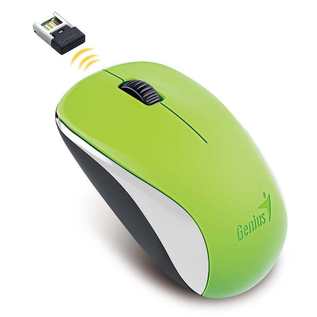
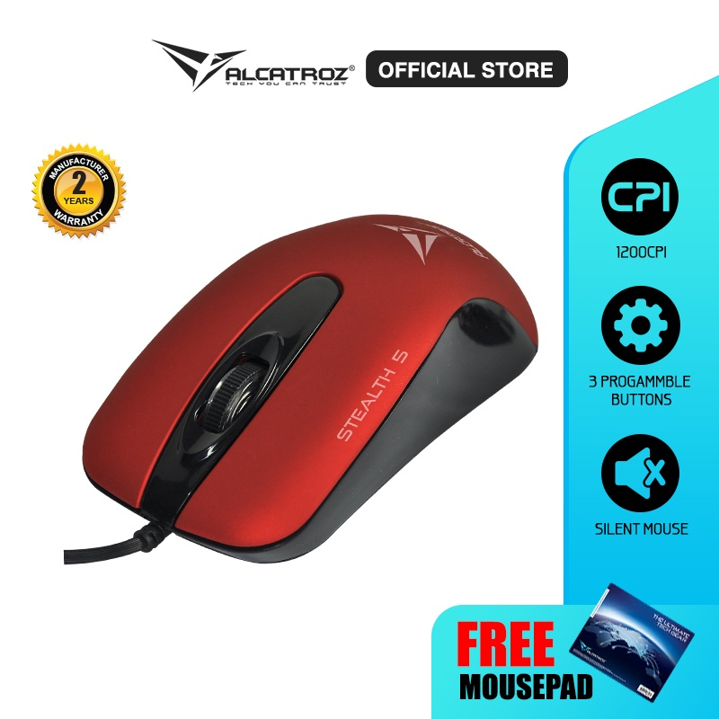

<html lang="en">
  <head>
    <meta charset="utf-8" />
    <meta content="width=device-width, initial-scale=1.0" name="viewport" />
    <title>Mini Ecommerce</title>
    
    <link
      href="https://cdnjs.cloudflare.com/ajax/libs/font-awesome/5.15.3/css/all.min.css"
      rel="stylesheet"
    />
  </head>
  <body class="bg-gray-100">
    

      <!-- Header -->
      

        <h1 class="text-xl font-bold">Mini Ecommerce</h1>
        

          <input
            id="search-input"
            class="border border-gray-300 rounded p-2"
            placeholder="all"
            type="text"
          />
          <button
            id="search-button"
            class="bg-green-500 text-white px-4 py-2 rounded"
          >
            Search
          </button>
          <button
            class="bg-purple-500 text-white px-4 py-2 rounded"
            id="cart-button"
          >
            <i class="fas fa-shopping-cart"></i> 0
          </button>
        

      

      <!-- Products -->
      

        <!-- Product 1 -->
        

          
          <h2 class="text-lg font-bold mb-2">Keyboard Logitek</h2>
          
Keyboard yang mantap untuk kantoran

          
Rp 60.000,00

          <button
            class="bg-purple-500 text-white px-4 py-2 rounded add-to-cart"
            data-product-id="1"
          >
            Add To Cart
          </button>
          <button
            class="bg-red-500 text-white px-4 py-2 rounded remove-from-cart hidden"
            data-product-id="1"
          >
            Remove From Cart
          </button>
        

        <!-- Product 2 -->
        

          
          <h2 class="text-lg font-bold mb-2">Keyboard MSI</h2>
          
Keyboard gaming MSI mekanik

          
Rp 300.000,00

          <button
            class="bg-purple-500 text-white px-4 py-2 rounded add-to-cart"
            data-product-id="2"
          >
            Add To Cart
          </button>
          <button
            class="bg-red-500 text-white px-4 py-2 rounded remove-from-cart hidden"
            data-product-id="2"
          >
            Remove From Cart
          </button>
        

        <!-- Product 3 -->
        

          
          <h2 class="text-lg font-bold mb-2">Mouse Genius</h2>
          
Mouse Genius biar lebih pinter

          
Rp 50.000,00

          <button
            class="bg-purple-500 text-white px-4 py-2 rounded add-to-cart"
            data-product-id="3"
          >
            Add To Cart
          </button>
          <button
            class="bg-red-500 text-white px-4 py-2 rounded remove-from-cart hidden"
            data-product-id="3"
          >
            Remove From Cart
          </button>
        

        <!-- Product 4 -->
        

          
          <h2 class="text-lg font-bold mb-2">Mouse Jerry</h2>
          
Mouse yang nyaman untuk digunakan

          
Rp 70.000,00

          <button
            class="bg-purple-500 text-white px-4 py-2 rounded add-to-cart"
            data-product-id="4"
          >
            Add To Cart
          </button>
          <button
            class="bg-red-500 text-white px-4 py-2 rounded remove-from-cart hidden"
            data-product-id="4"
          >
            Remove From Cart
          </button>
        

      

    

    
  </body>
</html>

